# FIAP Kitchenet

Aplicativo mobile de pedidos para a cantina da FIAP, desenvolvido como projeto avaliativo da disciplina de **Mobile Development with IoT** — turma MDI.


---

## Sobre o Projeto

O **FIAP Kitchenet** permite que alunos realizem pedidos de lanches, bebidas e doces diretamente pelo celular, acompanhem o preparo em tempo real, retirem no balcão usando um código gerado automaticamente e personalizem a interface com tema claro ou escuro.

🎥 **Vídeo de demonstração:** https://www.youtube.com/watch?v=MJMegTU_jIQ

---

## Funcionalidades

| Funcionalidade | Descrição |
|---|---|
| Cadastro | Criação de conta com nome completo, RM e senha |
| Login | Autenticação com RM (`rm000000@fiap.com.br`) e senha |
| Cardápio | Itens organizados por categoria (Bebidas, Lanches, Doces) com imagens |
| Carrinho | Adicionar, remover e ajustar quantidade de itens |
| Finalizar Pedido | Modal com resumo do pedido e opções de pagamento (PIX, Crédito, Débito) |
| Timer de Preparo | Contagem regressiva exibida na tela de Retirada enquanto o pedido é preparado |
| Notificação | Push notification enviada quando o pedido está pronto para retirada |
| Código de Retirada | Código de 4 dígitos gerado automaticamente para retirada no balcão |
| Histórico de Pedidos | Lista de todos os pedidos com status (Preparando / Pronto / Concluído) |
| Tema Claro / Escuro | Alternância de tema persistida entre sessões via AsyncStorage |
| Perfil | Visão geral do usuário logado com acesso ao histórico |

---

## Fluxo do Aplicativo

```
Cadastro / Login → Cardápio → Carrinho → Finalizar Pedido
       ↓
  Timer de Preparo → Notificação → Código de Retirada → Concluído
```

1. **Cadastro** — novo aluno cria conta com nome, RM e senha
2. **Login** — aluno autentica com RM e senha
3. **Cardápio (aba Pedir)** — navega pelos itens, adiciona ao carrinho
4. **Finalizar Pedido** — revisa resumo e escolhe forma de pagamento
5. **Timer de Preparo** — aba Retirada exibe contagem regressiva do preparo
6. **Notificação** — push notification avisa quando o pedido fica pronto
7. **Código de Retirada** — código de 4 dígitos é exibido para apresentar no balcão
8. **Concluir** — aluno confirma a retirada e o pedido é marcado como concluído
9. **Perfil** — histórico completo de pedidos e alternância de tema

---

## Screenshots

<p align="center">
  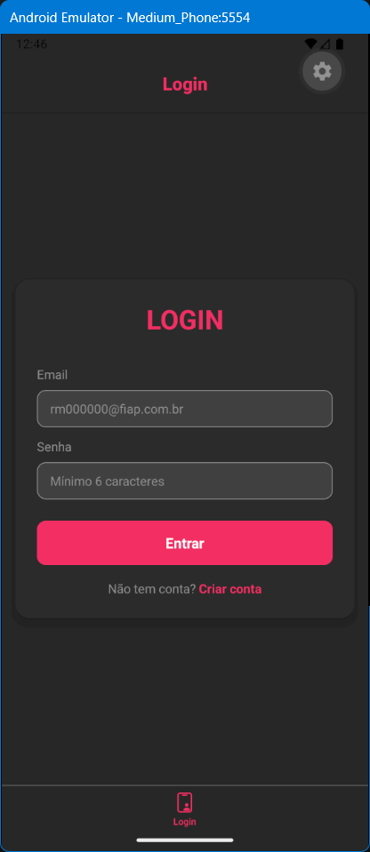
  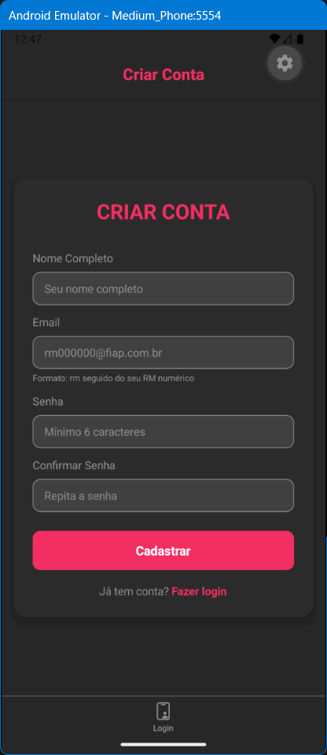
  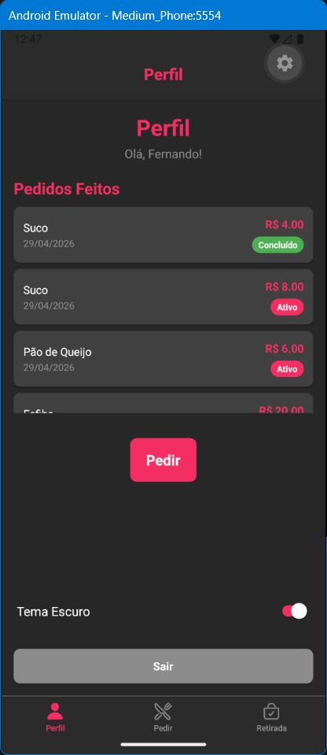
  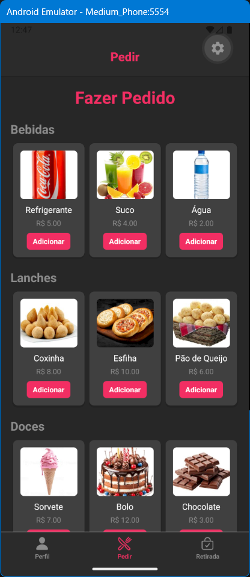
</p>
<p align="center">
  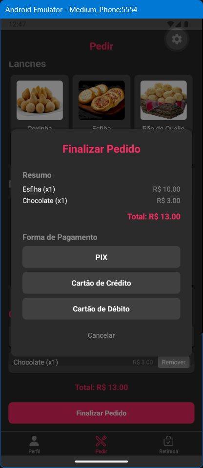
  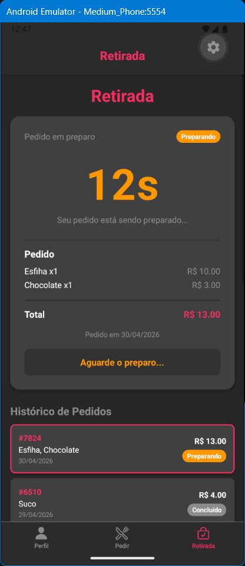
  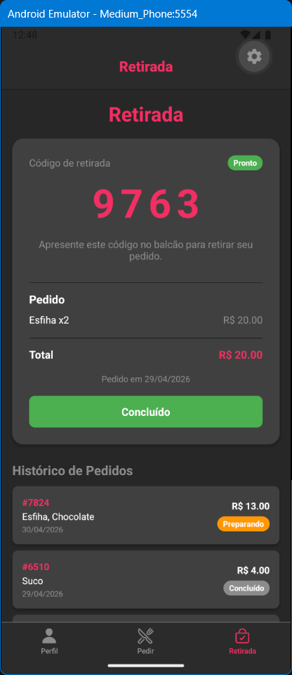
  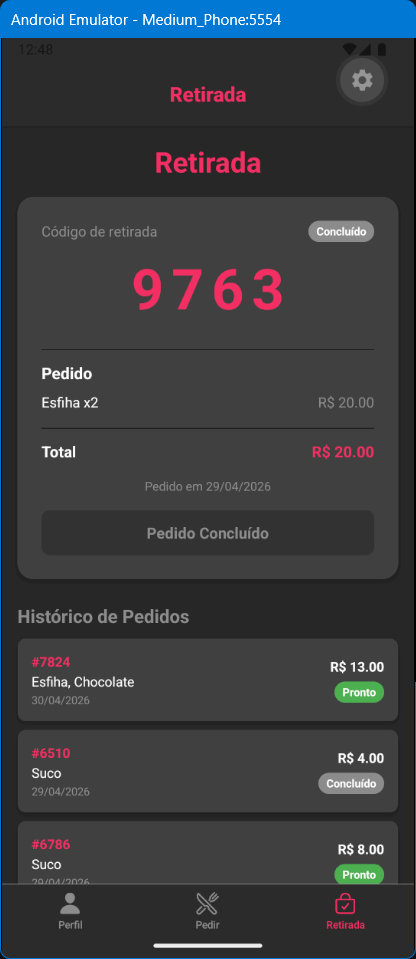
</p>
<p align="center">
  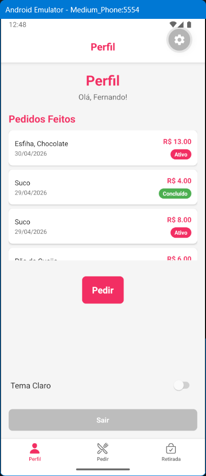
  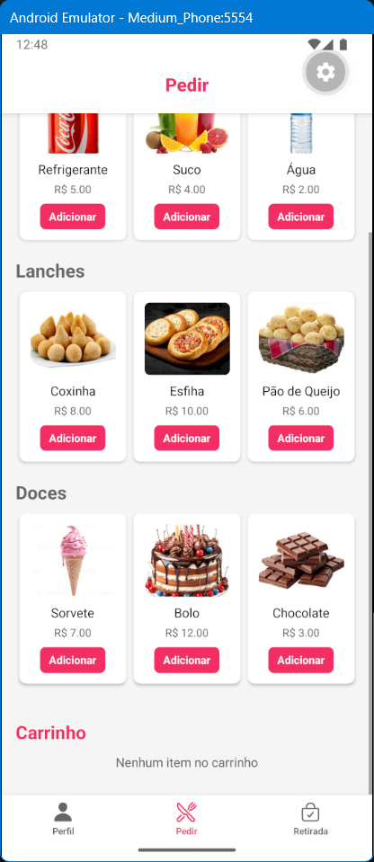
  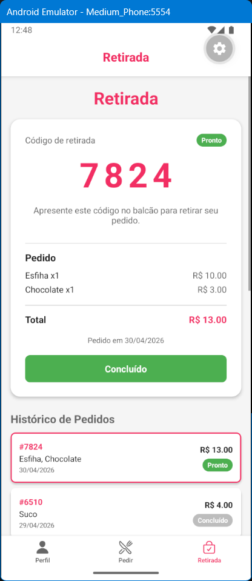
</p>

---

## Tecnologias Utilizadas

| Pacote | Versão | Uso |
|---|---|---|
| [React Native](https://reactnative.dev/) | `0.83.2` | Framework base do app |
| [Expo](https://expo.dev/) | `~55.0.8` | Toolchain e runtime |
| [Expo Router](https://expo.github.io/router/) | `~55.0.7` | Navegação file-based com grupos de rotas |
| [expo-notifications](https://docs.expo.dev/versions/latest/sdk/notifications/) | `~55.0.21` | Push notifications locais |
| [AsyncStorage](https://react-native-async-storage.github.io/async-storage/) | `^2.2.0` | Persistência local de sessão e tema |
| [expo-status-bar](https://docs.expo.dev/versions/latest/sdk/status-bar/) | `~55.0.4` | Controle da barra de status |
| [react-native-safe-area-context](https://docs.expo.dev/versions/latest/sdk/safe-area-context/) | `~5.6.2` | Áreas seguras em dispositivos modernos |
| [react-native-screens](https://docs.expo.dev/versions/latest/sdk/screens/) | `~4.23.0` | Otimização de navegação nativa |
| [@expo/vector-icons](https://icons.expo.fyi/) | — | Ícones da interface (Ionicons) |

---

## Estrutura do Projeto

```
FIAP-Kitchenet/
├── app/
│   ├── _layout.js              # Layout raiz — providers e redirecionamento inicial
│   ├── auth.js                 # Re-exporta funções de autenticação
│   ├── pedidos.js              # Re-exporta funções de pedidos
│   ├── notifications.js        # Re-exporta funções de notificações
│   ├── (tabs)/                 # Grupo de abas principais (usuário logado)
│   │   ├── _layout.js          # Tab bar com tema dinâmico
│   │   ├── perfil.js           # Perfil, histórico de pedidos e toggle de tema
│   │   ├── pedir.js            # Cardápio, carrinho e modal de pagamento
│   │   └── retirada.js         # Timer de preparo, código e histórico
│   ├── (auth)/                 # Grupo de rotas de autenticação
│   │   ├── _layout.js          # Layout da área de autenticação
│   │   ├── login.js            # Tela de login
│   │   └── cadastro.js         # Tela de cadastro de novo usuário
│   └── context/                # Stubs de contexto (re-exportam de lib/)
│       ├── AuthContext.js
│       ├── AppDataContext.js
│       └── ThemeContext.js
├── lib/                        # Lógica de negócio (fora do roteamento)
│   ├── auth.js                 # Autenticação com AsyncStorage
│   ├── pedidos.js              # CRUD de pedidos com AsyncStorage
│   ├── notifications.js        # Notificações compatíveis com Expo Go
│   └── context/
│       ├── AuthContext.js      # Context + Provider de autenticação
│       ├── AppDataContext.js   # Context + Provider de pedidos
│       └── ThemeContext.js     # Context + Provider de tema claro/escuro
├── components/
│   ├── Button.js               # Botão reutilizável com tema
│   └── Input.js                # Input reutilizável com tema
├── constants/
│   └── colors.js               # Paletas lightColors e darkColors
├── hooks/
│   └── useStorage.js           # Hook utilitário para AsyncStorage
├── assets/
│   ├── fotoscardapio/          # Imagens dos itens do cardápio
│   └── img-readme/             # Screenshots para documentação
├── app.json                    # Configuração do Expo
└── package.json                # Dependências do projeto
```

---

## Como Executar

### Pré-requisitos

- [Node.js](https://nodejs.org/) v18 ou superior instalado
- Aplicativo **Expo Go** no celular:
  - [Android — Google Play](https://play.google.com/store/apps/details?id=host.exp.exponent)
  - [iOS — App Store](https://apps.apple.com/app/expo-go/id982107779)
- Ou um emulador Android/iOS configurado localmente

---

### Passo a passo

**1. Clone o repositório**
```bash
git clone https://github.com/fernmoraes/fiap-mdi-cp2-FIAP-Kitchenet.git
cd fiap-mdi-cp2-FIAP-Kitchenet
```

**2. Instale as dependências**
```bash
npm install --legacy-peer-deps
```

> A flag `--legacy-peer-deps` é necessária por conflitos entre versões internas do Expo SDK 55 e React 19.

**3. Inicie o servidor de desenvolvimento**
```bash
npx expo start
```

**4. Abra o aplicativo**

| Plataforma | Como abrir |
|---|---|
| Celular físico | Escaneie o QR Code exibido no terminal com o app Expo Go |
| Emulador Android | Pressione `a` no terminal após o servidor iniciar |
| Emulador iOS | Pressione `i` no terminal após o servidor iniciar |
| Navegador web | Pressione `w` no terminal |

---

### Criando uma conta

1. Na tela de login, toque em **"Criar conta"**
2. Preencha nome completo, email no formato `rm000000@fiap.com.br` e senha (mínimo 6 caracteres)
3. Após o cadastro, faça login com as credenciais criadas

> O armazenamento é local — os dados ficam salvos no próprio dispositivo via AsyncStorage.

---

## Equipe e Contribuições

| Integrante | Branch | Contribuição |
|---|---|---|
| Fernando Moraes | `Fernando` | Estrutura base, Login, Cardápio, AsyncStorage , Notificações |
| Weslley | `Weslley` | React Context |
| Guilherme | `Guilherme` | Carrinho |
| Bruna | `Bruna` | Documentação |
| Gabriel | `Gabriel` | Tema Claro e Escuro |

---

## Contexto Acadêmico

> Projeto desenvolvido para o **Checkpoint 2** da disciplina de Mobile Development with IoT — FIAP, 2025.
