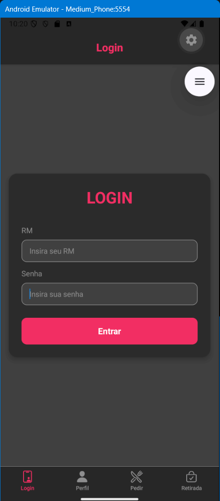
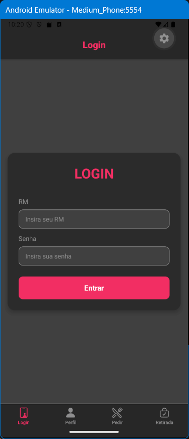
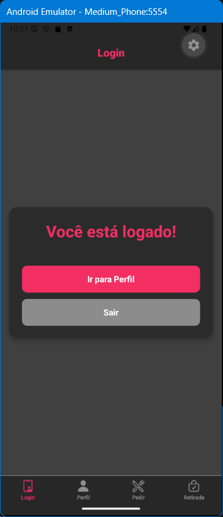
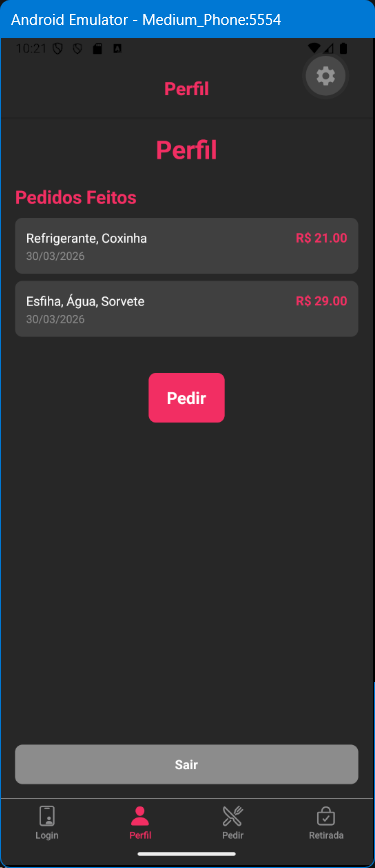
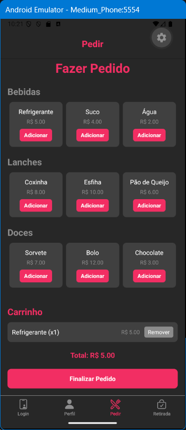
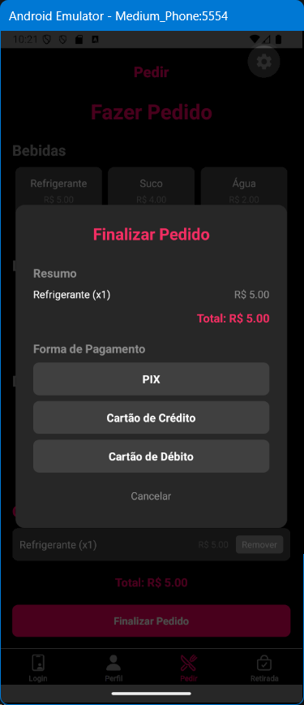
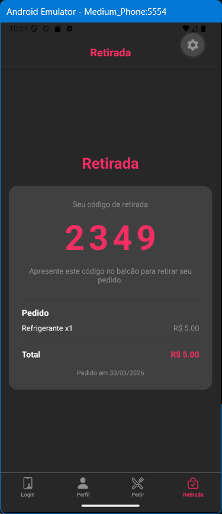

# FIAP Kitchenet

Aplicativo mobile de pedidos para a cantina da FIAP, desenvolvido como projeto avaliativo da disciplina de **Mobile Development with IoT** — turma MDI.


---

## Sobre o Projeto

O **FIAP Kitchenet** permite que alunos realizem pedidos de lanches, bebidas e doces diretamente pelo celular, acompanhem seus pedidos no perfil e retirem no balcão usando um código gerado automaticamente.
Link do vídeo mostrando o funcionamento:
https://youtube.com/shorts/7Cu7EE4myg8?feature=share

---

## Funcionalidades

| Funcionalidade | Descrição |
|---|---|
| Login | Autenticação com RM e senha (simulado) |
| Cardápio | Visualização de itens por categoria com carrinho |
| Finalizar Pedido | Modal com resumo e opções de pagamento (PIX, Crédito, Débito) |
| Histórico | Seção "Perfil" com todos os pedidos realizados |
| Retirada | Código de 4 dígitos gerado para retirada no balcão |

---

## Fluxo do Aplicativo

```
Login → Cardápio → Carrinho → Finalizar Pedido → Perfil → Retirada
```

1. **Login** — aluno informa RM e senha para acessar o app
2. **Cardápio** — navega pelos itens, adiciona ao carrinho
3. **Finalizar Pedido** — revisa o resumo e escolhe a forma de pagamento
4. **Perfil** — visualiza o histórico de todos os pedidos realizados
5. **Retirada** — exibe o código de 4 dígitos para retirar o pedido no balcão

---

## Screenshots

<p align="center">
  
  
  
  
  
  
  
</p>

---

## Tecnologias Utilizadas

| Pacote | Versão | Uso |
|---|---|---|
| [React Native](https://reactnative.dev/) | `0.83.2` | Framework base do app |
| [Expo](https://expo.dev/) | `~55.0.8` | Toolchain e runtime |
| [Expo Router](https://expo.github.io/router/) | `~55.0.7` | Navegação por abas (file-based) |
| [expo-status-bar](https://docs.expo.dev/versions/latest/sdk/status-bar/) | `~55.0.4` | Controle da barra de status |
| [react-native-safe-area-context](https://docs.expo.dev/versions/latest/sdk/safe-area-context/) | `~5.6.2` | Áreas seguras em dispositivos modernos |
| [react-native-screens](https://docs.expo.dev/versions/latest/sdk/screens/) | `~4.23.0` | Otimização de navegação nativa |
| [@expo/vector-icons](https://icons.expo.fyi/) | — | Ícones da interface |

---

## Estrutura do Projeto

```
fiap-mdi-cp1-FIAP-Kitchenet/
├── app/
│   ├── _layout.js      # Configuração das abas de navegação
│   ├── index.js        # Tela de Login
│   ├── pedir.js        # Cardápio, Carrinho e Modal de Pagamento
│   ├── perfil.js       # Perfil do usuário e histórico de pedidos
│   ├── retirada.js     # Código de retirada do pedido
│   ├── auth.js         # Controle de autenticação
│   └── pedidos.js      # Armazenamento compartilhado de pedidos
├── assets/             # Ícones e imagens do app
├── app.json            # Configuração do Expo
└── package.json        # Dependências do projeto
```

---

## Como Executar

### Pré-requisitos

- [Node.js](https://nodejs.org/) instalado
- Aplicativo **Expo Go** no celular ([Android](https://play.google.com/store/apps/details?id=host.exp.exponent) / [iOS](https://apps.apple.com/app/expo-go/id982107779))
- Ou um emulador Android/iOS configurado

### Passo a passo

**1. Clone o repositório**
```bash
git clone https://github.com/fernmoraes/fiap-mdi-cp1-FIAP-Kitchenet.git
cd fiap-mdi-cp1-FIAP-Kitchenet
```

**2. Instale as dependências**
```bash
npm install --legacy-peer-deps
```

> A flag `--legacy-peer-deps` é necessária devido a conflitos de versão entre dependências internas do Expo SDK 55.

**3. Inicie o servidor de desenvolvimento**
```bash
npx expo start
```

**4. Abra o aplicativo**

| Plataforma | Como abrir |
|---|---|
| Celular físico | Escaneie o QR Code com o app Expo Go |
| Emulador Android | Pressione `a` no terminal, ou `npm run android` |
| Emulador iOS | Pressione `i` no terminal, ou `npm run ios` |
| Navegador | Pressione `w` no terminal, ou `npm run web` |

### Credenciais de teste

O login é simulado — qualquer RM e senha preenchidos permitem o acesso.

---

## Equipe e Contribuições

| Integrante | Branch | Contribuição |
|---|---|---|
| Fernando Moraes | `Fernando` | Estrutura base, Login, Cardápio e Carrinho |
| Weslley | `Weslley` | Seção "Finalizar Pedido" com modal de pagamento |
| Guilherme | `Guilherme` | Integração dos pedidos com a seção "Perfil" |
| Bruna | `Bruna` | Seção "Retirada" com código do pedido |
| Gabriel | `Gabriel` | Documentação |

---

## Contexto Acadêmico

> Projeto desenvolvido para o **Checkpoint 1** da disciplina de Mobile Development with IoT — FIAP, 2025.
